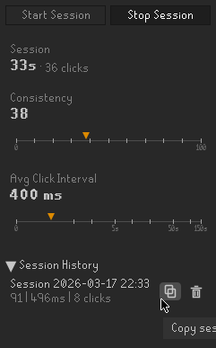

# AFK Stats Tracker

This RuneLite plugin tracks mouse clicks during AFK sessions in Old School RuneScape.

Tracked Stats:
- Consistency: A score from 0 to 100 showing how regular your click timing is. Higher scores mean more consistent intervals.
- Average Click Interval: The average time in milliseconds between clicks.
- Average Click Distance: The average distance the mouse moves between clicks, as a percentage of the game canvas diagonal (0–100%).
- Session: Live elapsed time and click count while a session is running.

Use it to compare AFK activities and training methods, the same way you track DPS or kills/hr.

Session history shows your most recent sessions first. Click a session name to rename it. Sessions can be copied to clipboard or deleted (with confirmation). The Start/Stop buttons and live stats stay pinned in place; only the history list scrolls when it grows long.

## Community Stats Site

Share your sessions and compare against everyone else's at [afk.statstracker.workers.dev](https://afk.statstracker.workers.dev/). Copy a session as JSON from the panel (copy icon → Copy JSON), paste it on the Submit page, and browse charts of consistency, click interval, and distance across activities. The "View community stats" link at the bottom of the plugin panel opens the site.

## Wiki Guide

See the [AFK Activity Tracker Guide](https://oldschool.runescape.wiki/w/Guide:AFK_Activity_Tracker) on the Old School RuneScape Wiki for a detailed breakdown of the tracked metrics, interactive scatter plots comparing activities, and aggregated averages across activity groups like Bankstanding, Fishing, and Salvaging.
